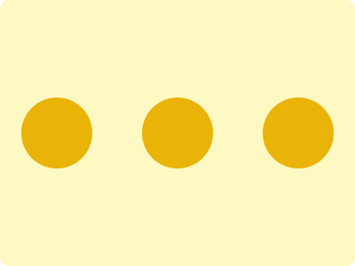

# Tailwind Battle Daily Challenge: 03/04/2024

### Daily Targets to Solve

  
[see the daily target](https://www.tailwindbattle.com/play/5)  
Check out the solution video on [YouTube](https://www.youtube.com/watch?v=40R_da1ul8E)

### Stats

**Accuracy**: 100%  
**Score**: 100%

### Code

```html
<div class="flex justify-around items-center h-screen bg-yellow-100">
  <div class="w-20 h-20 rounded-full bg-yellow-500 mr-2"></div>
  <div class="w-20 h-20 rounded-full bg-yellow-500"></div>
  <div class="w-20 h-20 rounded-full bg-yellow-500 ml-2"></div>
</div>
```

### Code Explanation:

- **Flex Container (`flex justify-around items-center h-screen bg-yellow-100`):** This `<div>` container utilizes Tailwind's flex utilities to arrange its child elements with equal space around them horizontally. It also centers its child elements vertically using `items-center` and sets the background color to a light yellow shade (`bg-yellow-100`).

- **Petals (`div` with background colors):** Three `<div>` elements are used to represent the petals of the flower. Each `<div>` has a width and height of 20 units and is styled with Tailwind's `rounded-full` utility to make them circular. Additionally, each petal has a background color of yellow (`bg-yellow-500`), giving them the appearance of being petals of the same flower.

  - The first `<div>` is positioned to the right with a margin of 2 units (`mr-2`).
  - The second `<div>` is in the middle.
  - The third `<div>` is positioned to the left with a margin of 2 units (`ml-2`).

This implementation effectively creates a visually appealing composition resembling a flower with three yellow petals, achieving a perfect match and a high score.